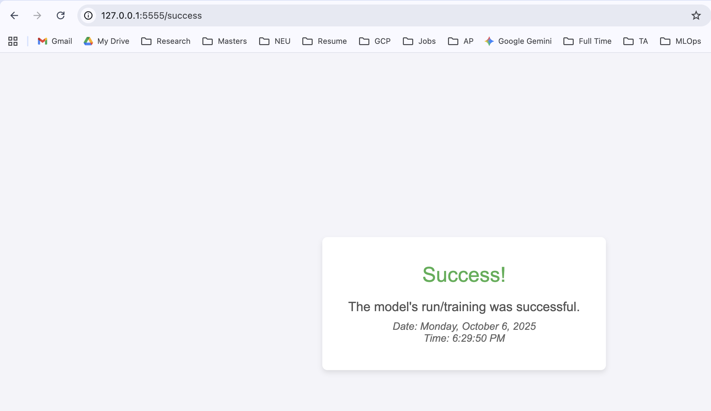

# Lab 2 - MLOps with Apache Airflow
## Wine Quality Classification Pipeline

A modified version of Airflow Lab 2 that implements an end-to-end machine learning pipeline for wine quality classification using Random Forest and Apache Airflow orchestration.

## Table of Contents
- [Project Overview](#project-overview)
- [Key Modifications](#key-modifications)
- [Architecture](#architecture)
- [Prerequisites](#prerequisites)
- [Setup Instructions](#setup-instructions)
- [Running the Pipeline](#running-the-pipeline)
- [Results](#results)
- [Project Structure](#project-structure)

## Project Overview

This project demonstrates MLOps best practices by creating an automated machine learning pipeline using Apache Airflow. The pipeline trains a Random Forest classifier on wine quality data, evaluates model performance, sends email notifications, and serves results via a Flask dashboard.

### Features
- Automated ML pipeline orchestration with Airflow
- Random Forest classification model
- Comprehensive model evaluation metrics
- Email notifications on training completion
- Interactive Flask dashboard for results monitoring
- Dockerized deployment for consistency

## Key Modifications

This lab includes significant modifications from the original template:

| Aspect | Original | Modified |
|--------|----------|----------|
| **Dataset** | Advertising clicks | Wine quality (1000 samples) |
| **Model** | Logistic Regression | Random Forest Classifier |
| **Features** | 5 marketing metrics | 11 physicochemical properties |
| **Target** | Binary click prediction | Binary quality classification (good/bad) |
| **Evaluation** | Basic accuracy | Accuracy, Precision, Recall, F1-score |
| **Tasks** | 6 tasks | 8 tasks (added evaluation + email) |
| **Dashboard** | Basic status | Enhanced metrics visualization |

## Architecture

### Pipeline Flow
```
Data Loading → Preprocessing → Train/Test Split → Model Training → 
Evaluation → Model Loading → Email Notification → Flask Dashboard
```

### Components
- **Airflow Webserver**: UI and API (Port 8080)
- **Airflow Scheduler**: Task orchestration
- **Airflow Triggerer**: Async task handling
- **PostgreSQL**: Metadata database
- **Flask Dashboard**: Results visualization (Port 5555)

## Prerequisites

- Docker Desktop (Mac/Windows/Linux)
- Docker Compose v2.0+
- Git
- 4GB+ RAM allocated to Docker
- 10GB+ free disk space

## Setup Instructions

### 1. Clone Repository

```bash
git clone https://github.com/yourusername/Labs2-MLOps.git
cd Labs2-MLOps/Lab_2
```

### 2. Generate Wine Quality Dataset

```bash
python3 create_wine_dataset.py
```

This creates `dags/data/wine_quality.csv` with 1000 wine samples.

### 3. Configure SMTP (Optional)

To enable email notifications, the SMTP settings are already configured in `docker-compose.yaml`. Update with your Gmail credentials:

```yaml
AIRFLOW__SMTP__SMTP_USER: your.email@gmail.com
AIRFLOW__SMTP__SMTP_PASSWORD: your_16_char_app_password
AIRFLOW__SMTP__SMTP_MAIL_FROM: your.email@gmail.com
```

Get Gmail app password: [Google Account Settings](https://myaccount.google.com/security)

### 4. Run Setup Script

```bash
chmod +x setup.sh
./setup.sh
```

Wait 60 seconds for all services to initialize.

### 5. Access Airflow UI

Open browser: http://localhost:8080

**Login Credentials:**
- Username: `airflow`
- Password: `airflow`

## Running the Pipeline

### Method 1: Via Airflow UI

1. Navigate to http://localhost:8080
2. Toggle `Airflow_Lab2` DAG to **ON**
3. Click **Trigger DAG** button
4. Monitor progress in Graph view

### Method 2: Via Command Line

```bash
# Unpause DAG
docker compose exec airflow-webserver airflow dags unpause Airflow_Lab2

# Trigger execution
docker compose exec airflow-webserver airflow dags trigger Airflow_Lab2

# Monitor status
docker compose exec airflow-webserver airflow dags list-runs -d Airflow_Lab2
```

### Pipeline Execution Time
Approximately 2-3 minutes for complete pipeline execution.

## Results

### Successful Pipeline Execution


*All tasks completed successfully with email notification sent*

### Flask Dashboard


*Real-time dashboard showing model training success*

### Email Notification


*Automated email sent upon successful model training*

### Flask Task Running


*Flask API task continuously running to serve dashboard*

### Model Performance Metrics

After successful execution, the model achieves:
- **Test Accuracy**: ~75-80%
- **Precision**: ~75-80%
- **Recall**: ~75-80%
- **F1 Score**: ~75-80%

Metrics are saved to: `/opt/airflow/model/metrics.json`

## Project Structure

```
Lab_2/
├── docker-compose.yaml          # Docker services configuration
├── setup.sh                     # Automated setup script
├── requirements.txt             # Python dependencies
├── create_wine_dataset.py       # Dataset generation script
├── .env                         # Environment variables (auto-generated)
├── README.md                    # This file
├── images/                      # Screenshots for documentation
│   ├── airflow_dag_success.png
│   ├── flask_dashboard_success.png
│   ├── email_notification.png
│   └── flask_task_running.png
├── dags/
│   ├── main.py                  # Main Airflow DAG
│   ├── Flask_API.py             # Flask dashboard DAG
│   ├── __init__.py
│   ├── src/
│   │   ├── __init__.py
│   │   └── model_development.py  # ML model code
│   ├── data/
│   │   ├── __init__.py
│   │   └── wine_quality.csv     # Dataset
│   └── templates/
│       ├── success.html         # Success page template
│       └── failure.html         # Failure page template
├── logs/                        # Airflow logs (auto-generated)
├── plugins/                     # Custom Airflow plugins
├── config/                      # Airflow configuration
├── working_data/                # Intermediate data storage
└── model/                       # Trained models and metrics
    ├── wine_rf_model.pkl
    ├── metrics.json
    └── scaler.pkl
```

## DAG Tasks

### Main DAG (`Airflow_Lab2`)

1. **identify_owner**: Display pipeline owner information
2. **load_wine_data**: Load wine quality CSV dataset
3. **preprocess_data**: Feature scaling and binary target creation
4. **separate_train_test**: Split data into train/test sets (80/20)
5. **train_random_forest**: Train Random Forest model (100 trees)
6. **evaluate_model**: Calculate performance metrics
7. **load_and_test_model**: Verify saved model
8. **trigger_flask_dashboard**: Launch Flask monitoring dashboard

### Flask DAG (`Airflow_Lab2_Flask`)

- **start_Flask_API**: Launch Flask web server on port 5555

## Access Points

- **Airflow Web UI**: http://localhost:8080
- **Flask Dashboard**: http://localhost:5555
- **Health Check**: http://localhost:5555/health
- **Metrics API**: http://localhost:5555/metrics

## Monitoring

### View Logs

```bash
# All services
docker compose logs -f

# Specific service
docker compose logs -f airflow-scheduler
docker compose logs -f airflow-webserver
```

### Check Task Status

```bash
# List DAG runs
docker compose exec airflow-webserver airflow dags list-runs -d Airflow_Lab2

# Check specific task
docker compose exec airflow-webserver airflow tasks state Airflow_Lab2 train_random_forest
```

### View Model Metrics

```bash
# View metrics file
docker compose exec airflow-webserver cat /opt/airflow/model/metrics.json

# Or via API
curl http://localhost:5555/metrics
```

## Stopping Services

```bash
# Stop all services (keeps data)
docker compose stop

# Stop and remove containers (keeps volumes)
docker compose down

# Remove everything including data
docker compose down -v
```

## Development

### Test Individual Task

```bash
docker compose exec airflow-webserver airflow tasks test Airflow_Lab2 load_wine_data 2024-01-01
```

### Access PostgreSQL Database

```bash
docker compose exec postgres psql -U airflow

# Useful queries
SELECT dag_id, state, start_date FROM dag_run ORDER BY start_date DESC LIMIT 5;
\q
```

### Modify DAG

1. Edit files in `dags/` directory
2. Save changes
3. Wait 30 seconds for Airflow to detect changes
4. Refresh Airflow UI

## Model Details

### Algorithm
- **Type**: Random Forest Classifier
- **Trees**: 100
- **Max Depth**: 10
- **Min Samples Split**: 5
- **Min Samples Leaf**: 2
- **Random State**: 42

### Dataset
- **Source**: Synthetic wine quality data
- **Samples**: 1000
- **Features**: 11 physicochemical properties
  - Fixed acidity, volatile acidity, citric acid
  - Residual sugar, chlorides
  - Free sulfur dioxide, total sulfur dioxide
  - Density, pH, sulphates, alcohol
- **Target**: Binary (0=bad wine, 1=good wine)
- **Split**: 80% train, 20% test

## Technologies Used

- **Apache Airflow 2.11.0**: Workflow orchestration
- **PostgreSQL 13**: Metadata database
- **Flask 3.0**: Web dashboard
- **scikit-learn 1.7.2**: Machine learning
- **pandas 2.1.4**: Data manipulation
- **Docker & Docker Compose**: Containerization

## Acknowledgments

- [Original lab template](https://github.com/raminmohammadi/MLOps/tree/main/Labs/Airflow_Labs/Lab_2) from MLOps course materials
- Apache Airflow documentation
- scikit-learn documentation

## Additional Resources

- [Airflow Documentation](https://airflow.apache.org/docs/)
- [Docker Compose Documentation](https://docs.docker.com/compose/)
- [scikit-learn Random Forest](https://scikit-learn.org/stable/modules/generated/sklearn.ensemble.RandomForestClassifier.html)
- [Flask Documentation](https://flask.palletsprojects.com/)